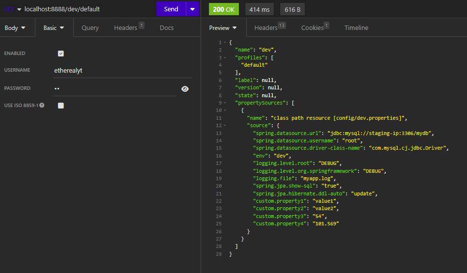
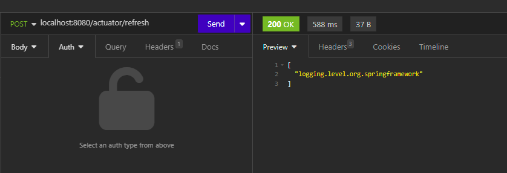
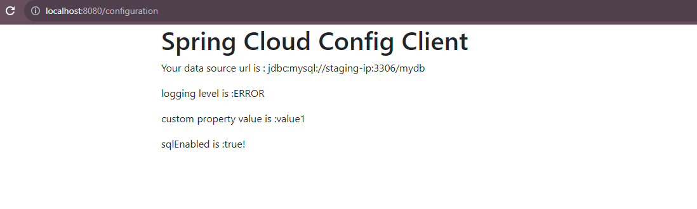

***Spring Configuration Server***

**Benefits**

1. Can switch environments as needed without needing server restart.
2. Can reduce the no of lines.
3. Can switch to various log levels
4. Maintain multiple profiles for different environments or activities eg: Performance Testing
5. Applicable for any technology as long as we do a rest call.

**Usage**

http://localhost:8888/dev/default

use basic authentication or any other form of Oauth2

Clients can configure 
management.endpoints.web.exposure.include=refresh 
and do a **POST** call as to reflect new changes without restarting client server

http://localhost:8080/actuator/refresh

^(?:20[0-9]{2}|19[0-9]{2})-(?:(?:(?:0[1-9]|1[0-2])-(?:0[1-9]|1\d|2[0-8]))|(?:(?:0[13-9]|1[0-2])-(?:29|30)|(?:0[13578]|1[02])-31))|(?:(?:20[0-9]{2}|19[0-9]{2})-02-(?:0[1-9]|1\d|2[0-9])))
